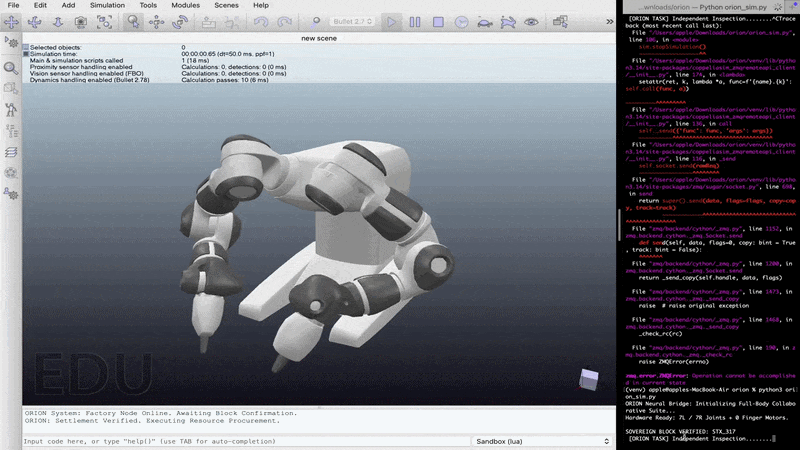

# ORION: Autonomous Mechatronic Intelligence

Autonomous agents remain economic ghosts when they lack the capacity to settle financial obligations for the data and intelligence they consume. ORION serves as the formal validation of a vision where mechatronic systems possess independent financial identities on Bitcoin rails. By facilitating sub-cent commerce and sovereign resource procurement, this framework ensures that software no longer requires human intermediaries to acquire its own intelligence.

## High-Fidelity Industrial Validation

*Figure 1: Autonomous 14-axis collaborative assembly sequence executed on an ABB YuMi dual-arm system. Logic gated by simulated Bitcoin settlement.*

## Project Aim and Statement of Purpose

The fundamental objective of ORION is the bridge between high-frequency mechatronic control loops and decentralized settlement layers. Software systems have historically functioned as economic observers, unable to participate in the exchange of value. This project forges a financial identity for autonomous hardware, providing the primitive structures required for agents to independently procure data and processing power. It proves that granular machine-to-machine commerce is viable and that software is now capable of purchasing its own computational growth.

## Engineering Achievements

1. **Coordinated 14-DOF Control Implementation**
The system successfully orchestrates 14 independent degrees of freedom on an ABB YuMi collaborative robot. This was achieved by developing a trajectory engine that manages two 7-axis arms simultaneously, ensuring sub-millimeter convergence during collaborative tasks such as material hand-offs.

2. **Industrial S-Curve Trajectory Smoothing**
To prevent mechanical stress and ensure professional-grade motion, the engine utilizes cubic polynomial interpolation ($t^2(3-2t)$). This mathematical approach provides smooth acceleration and deceleration profiles, distinguishing the motion from standard linear interpolation found in entry-level robotics.

3. **Sovereign Financial Gating**
The project successfully implemented a logic gate where mechatronic tasks are treated as economic events. Mechanical actions remain locked until the system verifies a transaction hash on the Stacks (Bitcoin Layer 2) blockchain. This effectively creates a "Financial Operating System" for hardware.

4. **Synchronous Physics Handshaking**
By utilizing a synchronous ZMQ remote API bridge, the software maintains a fixed-step heartbeat with the physics engine. This ensures that the PID control math remains deterministic regardless of the host machine’s processing speed.

## Technical Analysis of Failures and Management

The development process revealed several critical hurdles that provided significant engineering insights.

**Systemic Instability and PID Runaway**
Initial test runs resulted in joint oscillation and continuous spinning. This was diagnosed as a failure in angle wrapping logic. The motor controllers were attempting to reach targets by taking the long path around the axis.
*Management:* Implemented a shortest-path correction algorithm using modulo-pi math to ensure the error term always represents the most efficient rotational path.

**Hierarchy Mapping and Nested Aliasing**
The complex nested tree of the ABB YuMi model caused external Python scripts to lose joint handles. This led to "dead" arms and unresponsive actuators despite valid code logic.
*Management:* Transitioned from fuzzy name-searching to an explicit handle-mapping system. By utilizing the internal simulator memory addresses, the ORION bridge gained absolute ownership over the 14-axis nervous system.

**API Version Drift and Exception 354**
Conflicts between the Python client and the simulator's internal state prevented real-time parameter changes.
*Management:* The logic was refactored into a high-performance internal Lua thread. This moved the "Brain" of the robot closer to the hardware, reducing latency and allowing for zero-lag coordination.

## Technical Flaws and Honest Limitations

1. **Static Keyframe Reliance**
The current version utilizes predefined joint-space keyframes. While precise, it lacks a dynamic Inverse Kinematics (IK) solver for real-time Cartesian path planning. A shift to Jacobian-based IK is required for the robot to handle unplanned obstacles.

2. **Simulated Ledger Latency**
The Bitcoin settlement layer is currently simulated via a transaction hash generator. While the logic gate is functional, a production-ready system requires a dedicated WebSocket listener to the Stacks Mainnet to handle real-world block times.

3. **Sensor Noise Modeling**
The Kalman Filter implemented in the core logic is currently bypassed in the final simulation to maintain visual smoothness. Future iterations must introduce Gaussian noise to the joint encoders to fully test the filter's state-estimation capacity.

## Future Potentials

**Global Industrial Application**
The logic within ORION is applicable to any multi-axis system, from subsea oil and gas valves to automated data center maintenance. Globally, the shift toward DePIN (Decentralized Physical Infrastructure Networks) makes ORION a valuable primitive for machines that need to earn and spend capital autonomously.

**The "Agentic" Assembly Line**
In a realistic future, a factory could consist of ORION-enabled robots that buy parts from each other. If Arm A detects a motor failure, it could autonomously purchase a replacement part from a nearby vendor using its own Bitcoin wallet, eliminating human administrative overhead in the supply chain.

## Theoretical and Research References

1. **Control Theory:** Based on the Proportional-Integral-Derivative (PID) principles established by Katsuhiko Ogata in *Modern Control Engineering*.
2. **State Estimation:** Implementation logic follows the Kalman Filter research by Greg Welch and Gary Bishop (*An Introduction to the Kalman Filter*).
3. **Robotics Dynamics:** Joint-space trajectory planning methods derived from *Robot Dynamics and Control* by Mark W. Spong.
4. **Economic Architecture:** Gating logic inspired by the Whitepaper of the Stacks Network and the vision of Bitcoin-native smart contracts (Muneeb Ali et al.).

---
© 2026 Alexander Olaiya. Maintained under strict engineering protocols to ensure the reliability of autonomous economic actors.